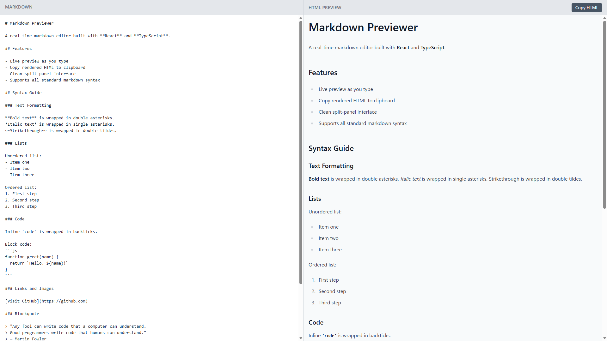

# Markdown Previewer

A real-time markdown editor built with React and TypeScript. Type markdown on the left and see a live rendered HTML preview on the right.

🔗 **[Live Demo](https://markdown-previewer-ten-beta.vercel.app)**



## Features

- Live HTML preview as you type
- Copy rendered HTML to clipboard with one click
- Clean split-panel interface
- Supports all standard markdown syntax — headings, bold, italic, lists, code blocks, tables, blockquotes and more
- Auto-focuses editor on load

## Tech Stack

- React
- TypeScript
- Tailwind CSS
- Vite
- marked.js

## Getting Started

### Run locally
```bash
git clone https://github.com/Koji1999/markdown-previewer
cd markdown-previewer
npm install
npm run dev
```

Open [http://localhost:5173](http://localhost:5173) in your browser.

### Or use the live demo

[https://markdown-previewer-ten-beta.vercel.app](https://markdown-previewer-ten-beta.vercel.app)